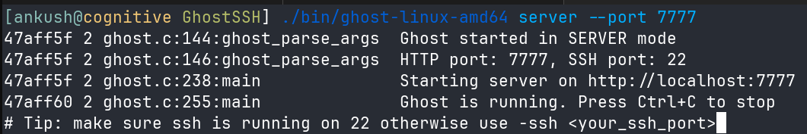
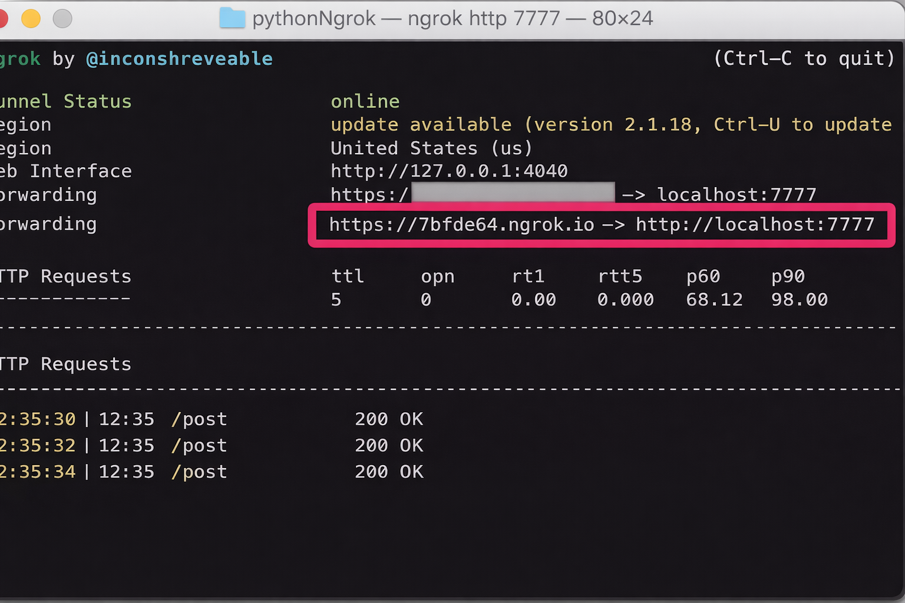
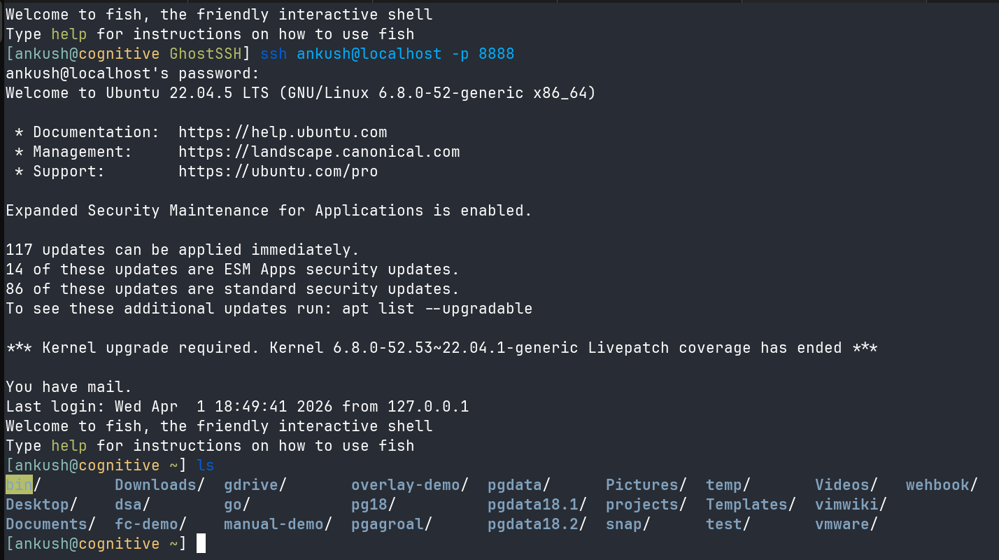

# GhostSSH
**GhostSSH Lightweight SSH-over-HTTPS proxy for secure and firewall-friendly remote access**

<p align="center">
  
</p>


GhostSSH is a lightweight tool that enables SSH access over secure WebSocket (WSS) connections. It allows you to connect to remote machines even when direct SSH traffic (port 22) is blocked, by tunneling it through standard HTTPS infrastructure.

In many environments — such as corporate networks, cloud platforms, or public Wi-Fi — only HTTP/HTTPS traffic is allowed. GhostSSH works by upgrading HTTP connections to WebSockets and streaming SSH data through them, enabling real-time, bidirectional communication without modifying the existing SSH server.

Instead of acting as a traditional HTTP proxy, GhostSSH creates a persistent tunnel:

* The client exposes a local TCP port for SSH
* Data is forwarded over a secure WebSocket (WSS) connection
* The server bridges this to the local SSH daemon (`sshd`)
* Responses are streamed back instantly

This makes GhostSSH behave like a raw TCP tunnel over WebSocket (WSS) using HTTPS infrastructure.

GhostSSH is:

* **Lightweight** — minimal dependencies
* **Real-time** — full-duplex streaming
* **Firewall-friendly** — runs over HTTPS (port 443)
* **Transparent** — works with standard SSH clients

It does not replace SSH or require changes to the SSH server—only provides a flexible transport layer on top.

## How to use

###  1. Start GhostSSH Server

Run the GhostSSH server on your machine (where `sshd` is running):

```bash
./bin/ghost-linux-amd64 server --port 7777
```

<p align="center">
  
</p>


> NOTE: Make sure SSH is running on port 22 (or specify using `--ssh`)


###  2. Expose Server using ngrok

Since GhostSSH uses WebSockets over HTTP, you can expose it using ngrok:

```bash
ngrok http 7777
```

<p align="center">
  
</p>

**Copy the generated *HTTPS URL* (e.g., `https://xxxxx.ngrok-free.dev`)**


###  3. Start GhostSSH Client

On the client machine, connect to the server using the ngrok URL:

```bash
./bin/ghost-linux-amd64 client \
  --connect https://your-ngrok-url.ngrok-free.dev \
  --port 8888
```

**This creates a local TCP port (`8888`) for SSH access**


###  4. Connect via SSH

Now use standard SSH to connect:

```bash
ssh ankush@localhost -p 8888
```
<p align="center">
  
</p>

**You are now connected to the remote machine through GhostSSH!**


### Flow Summary

```text
SSH Client (localhost:8888)
        ↓
GhostSSH Client
        ↓ (WSS over HTTPS via ngrok)
GhostSSH Server
        ↓
sshd (localhost:22)
```


#### Notes
* ngrok is used only to expose the server publicly
* GhostSSH itself handles the tunneling over WebSocket (WSS)
* Works in restricted networks where only HTTPS (port 443) is allowed

## Build Options

> Note: The project is in its inital phase recommended to build for linux amd64 or WSL

### 1. Default Build (Linux, dynamic linking)
```bash
make
```

Output:

```
bin/ghost-linux-amd64
```


### 2. Static Build (Linux, glibc)

```bash
make static
```

Output:

```
bin/ghost-linux-amd64-static
```


### 3. Portable Build (Linux, fully static)

This build uses musl and produces a fully static binary that works across most Linux distributions.

```bash
make musl
```

Output:

```
bin/ghost-linux-amd64-musl
```


### 4. Windows Build (cross-compiled)
> Note: TLS support is currently disabled in the Windows build.

```bash
make win
```

Output:

```
bin/ghost-windows-amd64.exe
```
