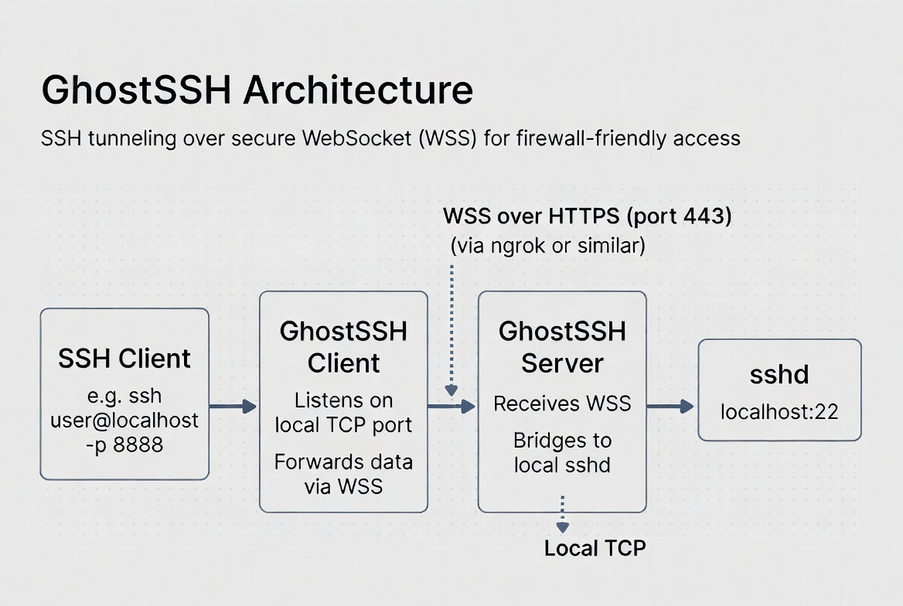

# Architecture

<p align="center">
  
</p>


```
---------------------- CLIENT MACHINE ----------------------
SSH Client (OpenSSH)
        ↓ raw SSH bytes
GhostSSH Client
        ↓ HTTPS/WSS
---------------------- INTERNET ----------------------------
HTTPS/WSS Tunnel
---------------------- SERVER MACHINE ----------------------
GhostSSH Server
        ↓ raw SSH bytes
Local sshd (real SSH server)
```
